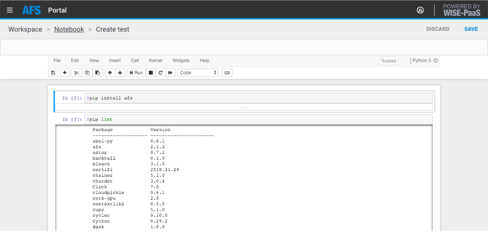

# AFS SDK

[](https://afs-docs.readthedocs.io/en/latest/?badge=latest)


## Documents
Reference documents [Readthedocs](http://afs-docs.readthedocs.io/en/latest/sdk/)


## Installation

Support python version 3.5 or later


### pip install on AFS notebook


AFS provides the release version SDK on private pypi server. Run the following command on notebook cell to install SDK:
 
```
!pip install afs
```

List the installed packages.




## Develop


### (For SDK developer) From sources

1. Clone the repository to local.

2. To build the library run:
```
$ python setup.py install
```

### (For SDK developer) Build from source

1. Clone the repository to local.

2. To build the wheel package:
```
$ python setup.py bdist_wheel
```

3. .whl will be in dist/ 