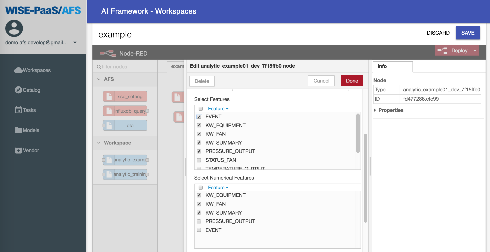
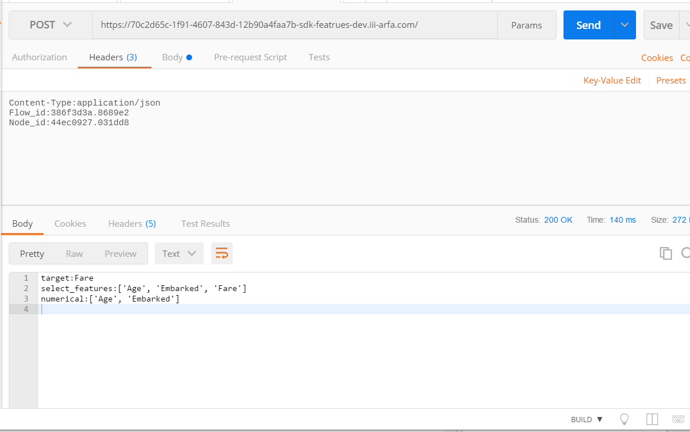
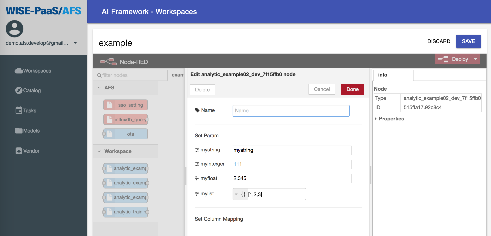
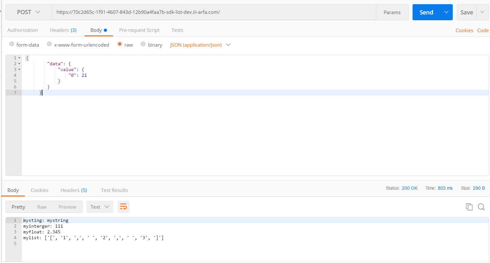

# Examples

## models

### upload_models

How to upload a model file on workspace. 

```
from afs import models

with open('model.h5', 'w') as f:
    f.write('dummy model')

eval_dict = {
    'confusion_matrix': {
        'TP': 0.9,
        'FP': 0.8,
        'TN': 0.7,
        'FN': 0.6
    },
    'AUC': 1.0
}

tags = {'machine': 'machine01'}

afs_models = models()
afs_models.upload_model(
    'model.h5', accuracy=0.4, loss=0.3, extra_evaluation=eval_dict, tags=tags)
```


## config_handler

### Features
How to write a AFS API to get features, including target, select_features, numerical. [[Example](https://github.com/benchuang11046/afs/blob/master/docs/jupyter_md/sdk_featrues.md)]

Flow setting



API response



### Parameter (Type string, integet, float, list)

How to write a AFS API to get parameters with types.  [[Example](https://github.com/benchuang11046/afs/blob/master/docs/jupyter_md/sdk_parameters.md)]

Flow setting



API response




### Data

How to write a AFS API to get data.  [[Example]()]

Flow setting


API response


### services

How to get the subscribed influxdb credential. 

```
from afs import services

myservice =  services()
credential = myservice.get_service_info()

# Show all the subscribed services.
print(credential)

# Select one of the influxdb service, check which influxdb you want.  
myinfluxdbl =  credential['influxdb'][0]

# Influxdb credential
username = myinfluxdb['username']
password = myinfluxdb['password']
host = myinfluxdb['host']
port = myinfluxdb['port']
database = myinfluxdb['database']
key = myinfluxdb['key']

```
