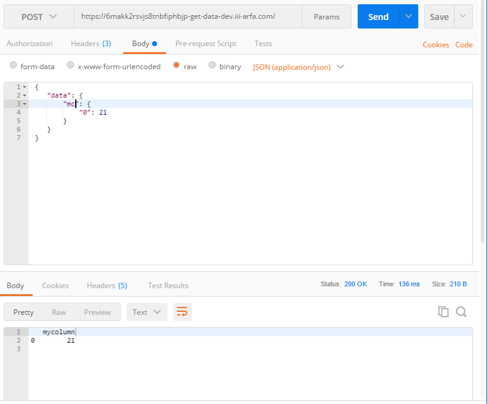
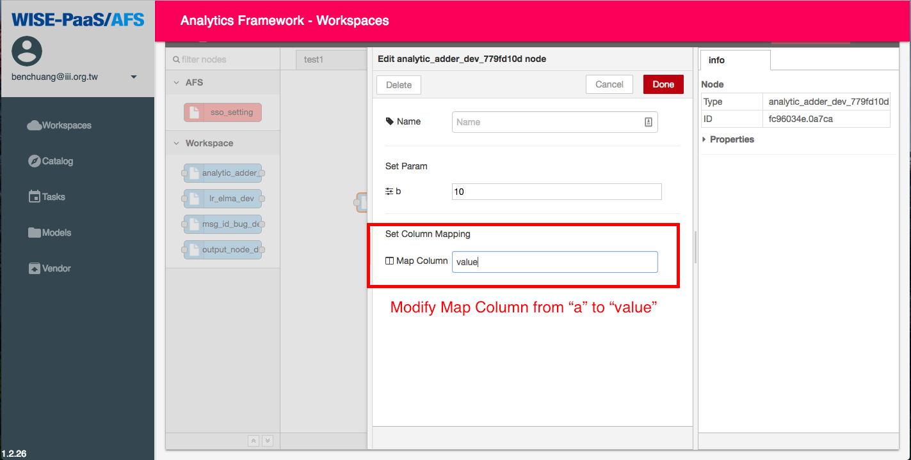

# Examples

## models

### upload_models

How to upload a model file on workspace. 

**Code**
```
from afs import models

# Write a file as model file.
with open('model.h5', 'w') as f:
    f.write('dummy model')

# User-define evaluation result
extra_evaluation = {
    'confusion_matrix': {
        'TP': 0.9,
        'FP': 0.8,
        'TN': 0.7,
        'FN': 0.6
    },
    'AUC': 1.0
}

# Tags means 
tags = {'machine': 'machine01'}

# Model object
afs_models = models()

# Upload the model to repository and the repository name is the same as file name.
# Accuracy and loss is necessary, but extra_evaluation and tags are optional.
afs_models.upload_model(
    'model.h5', accuracy=0.4, loss=0.3, extra_evaluation=extra_evaluation, tags=tags)

# Get the latest model info 
model_info = afs_models.get_latest_model_info('model.h5')

# See the model info
print(model_info)
```

**results**
```
{
	'evaluation_result': {
		'accuracy': 0.4,
		'loss': 0.3,
		'confusion_matrix': {
			'TP': 0.9,
			'FP': 0.8,
			'TN': 0.7,
			'FN': 0.6
		},
		'AUC': 1.0
	},
	'tags': {
		'machine': 'machine01'
	},
	'created_at': '2018-12-06 08:41:39'
}```


### get_latest_model_info

**Code**
```
from afs import models
afs_models = models()
afs_models.get_latest_model_info('test_model.h5')
```
**Output**
```
{'evaluation_result': {'accuracy': 0.123, 'loss': 0.123},
 'tags': {},
 'created_at': '2018-09-11 10:15:54'}
```


## config_handler

### Features
How to write a AFS API to get features, including target, select_features, numerical. [[Example](https://github.com/benchuang11046/afs/blob/master/docs/jupyter_md/sdk_featrues.md)]

#### Flow setting


#### API response

Post Request
```
 {
    "data": {
        "mc": {
            "0": 21
        }
    }
 }
```


### Parameter (Type string, integet, float, list)

How to write a AFS API to get parameters with types.  [[Example](https://github.com/benchuang11046/afs/blob/master/docs/jupyter_md/sdk_parameters.md)]

#### Flow setting


#### API response

Post Request
```
 {
    "data": {
        "mc": {
            "0": 21
        }
    }
 }
```


### Data

How to write a AFS API to get data.  [[Example](https://github.com/benchuang11046/afs/blob/master/docs/jupyter_md/sdk_data.ipynb)]

#### Flow setting


#### API response




### API Example using config_handler 


**Code**
```python
manifest = {
    'memory': 256,
    'disk_quota': 256,
    'buildpack': 'python_buildpack',
    "requirements":[
        "pandas",
        "afs"
    ],
    'type': 'API'
}
```


```python
from afs import config_handler
from pandas import DataFrame
import json

# Setting API parameters and column name
cfg = config_handler()
cfg.set_param('b', type='integer', required=True, default=10)
cfg.set_column('a')
cfg.summary()
```


```python
# POST /

# Set flow architecture, REQUEST is the request including body and headers from client
cfg.set_kernel_gateway(REQUEST)

# Get the parameter from node-red setting
b = cfg.get_param('b')

# Get the data from request, and transform to DataFrame Type
a = cfg.get_data()
result = a + b

# Send the result to next node, and result is  DataFrame Type
ret = cfg.next_node(result, debug=True)

# The printing is the API response.
print(json.dumps(ret))
```


**Solution**




**Request Example**

```
{
     "headers": {
         "Flow_id": "b896452e.73d968",
         "Node_id": "fb3d279.613efd8"
     },
     "body": {
         "data": {
             "value": {
                 "0": 21
             }
         }
      }
 }
```

**Response**
```
 {
    "random": 25,
    "result": {
        "data": {
            "value": {
                "0": 1045
            }
        },
        "node_id": "db4f28d6.59d7e8"
    }
}
```


## Services

How to get the subscribed influxdb credential. 

**Code**
```
from afs import services

myservice =  services()
credential = myservice.get_service_info('influxdb')

# Show one of the credential of the subscribed services.
print(credential)

# Influxdb credential
username = credential['username']
password = credential['password']
host = credential['host']
port = credential['port']
database = credential['database']

```

**Output**
```
{
	'database': '7cdd5039-59a4-4d78-b911-4ee984183227',
	'password': 'KggwuFtuNQxbxvQQAdJl2WGqw',
	'port': 8086,
	'host': '10.100.20.1',
	'uri': 'http://10.100.20.1:8086',
	'username': 'e821d27d-401e-4db1-8827-20270dfb73e7'
}
```
