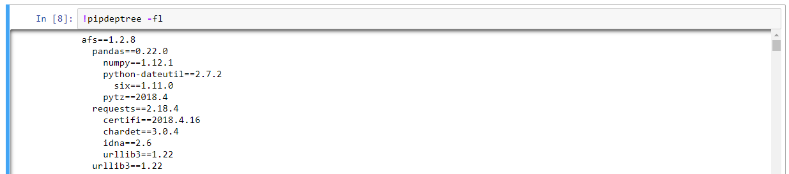

# Install AFS-SDK without external network
If you want install AFS-SDK without external network, you should install dependency step by step. The following is afs-sdk dependency tree:

## How to check out the dependency tree command 
```
! pip install pipdeptree
! pipdeptree -fl
```



## How to install module on private cloud

[Install module with Vendor in private cloud](https://afs-docs.readthedocs.io/en/latest/portal/workspace.html#install-module-with-vendor-in-private-cloud)


## AFS-SDK dependency tree
Install dependency module first.

### afs==1.2.16
```
  * influxdb
    * python-dateutil
      * six
    * pytz
    * requests
      * certifi
      * chardet
      * idna
      * urllib3
    * six
  * pandas
    * numpy
    * python-dateutil
      * six
    * pytz
  * requests
    * certifi
    * chardet
    * idna
    * urllib3
  * urllib3 
```

## (For developer) Build AFS-SDK whl  
To build the wheel module:
```
$ python setup.py bdist_wheel
```

AFS-SDK whl file will be in dist/ directory.
